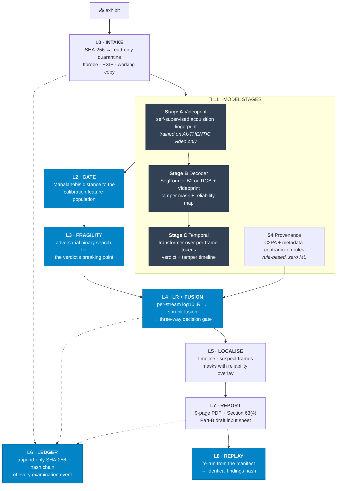
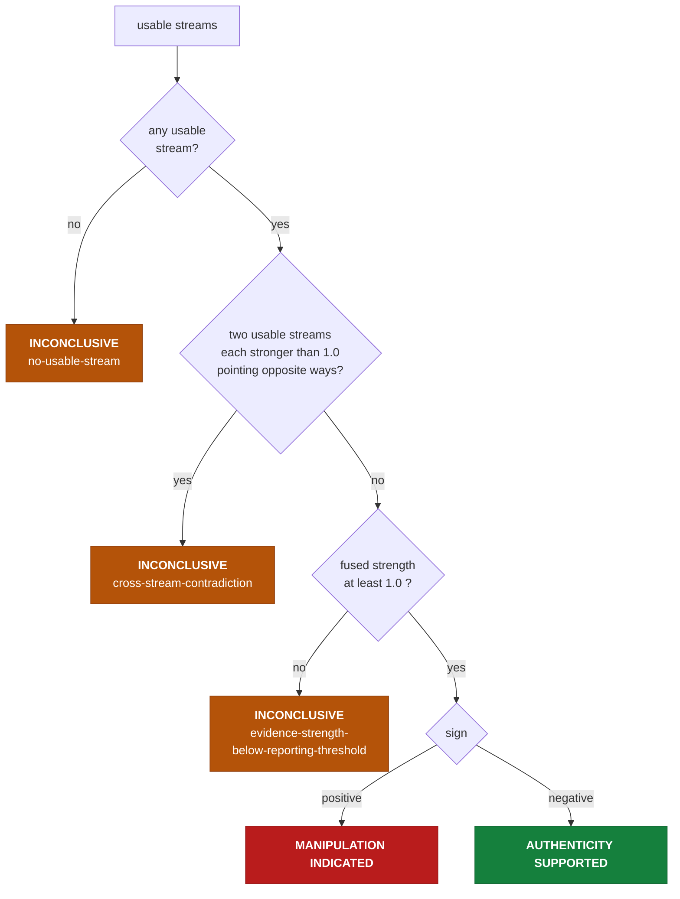

# ⚖️ Team Peri Peri Fries

### A Judicial Digital Evidence Authentication Engine

<div align="center">

[](https://www.python.org/)
[](https://pytorch.org/)
[](https://github.com/Jenak26/team-peri-peri-fries/actions/workflows/ci.yml)
[](tests/)
[](ruff.toml)
[](#-the-likelihood-ratio-layer--the-heart-of-the-system)
[](#-determinism-and-replay)
[](LICENSE)

</div>

**This is not a deepfake detector. It is a forensic examination protocol engine.**
It takes one video exhibit and returns a base-10 likelihood ratio between two
explicitly stated propositions, a declaration of whether the exhibit even falls
inside the population it was calibrated on, the exact laundering strength at which
its own conclusion breaks, a mandatory abstention path, and a hash-sealed examination
record that a second run reproduces byte-for-byte.

> [!IMPORTANT]
> **The deliverable is not a better score. It is a verdict a court can actually
> weigh - including the verdict "I don't know."** Every existing tool outputs
> `P(fake) = 0.97`. A court cannot do anything with that number: it has no stated
> propositions, no declared population, no validated domain, no uncertainty, and no
> way to reproduce it. This system is built backwards from what a cross-examination
> would destroy.

---

## 🎯 The two propositions

Stated verbatim in the code, in the API response, and on the report's findings page.
Everything the system reports is a ratio between exactly these two, and nothing else:

|  | Proposition |
|---|---|
| **H<sub>p</sub>** | the exhibit is an unmanipulated recording of a real event |
| **H<sub>d</sub>** | the exhibit is synthetically generated or materially manipulated in the facial region |

A likelihood ratio answers *"how much more probable are these findings if H<sub>d</sub>
is true than if H<sub>p</sub> is true?"* - which is a question about the evidence. It
deliberately does **not** answer *"is this video fake?"*, which is a question about
the world, and which belongs to the Court.

---

## 💡 Why I built this

I started where everyone starts: train a classifier, report AUROC, ship a percentage.
Then I read what happens to that percentage in a courtroom.

A probability of forgery has no defensible meaning as evidence. Ask the four
questions that opposing counsel will ask, and it collapses:

| The question | What `P(fake) = 0.97` can answer |
|---|---|
| *"Probability under which hypothesis, against which alternative?"* | Nothing. No propositions were ever stated. |
| *"On what population was that number calibrated, and is my client's phone in it?"* | Nothing. No validated domain was declared. |
| *"What happens to your conclusion after WhatsApp recompresses the file?"* | Nothing. It was never tested. |
| *"Can an independent examiner reproduce this exact figure?"* | Nothing. The model is nondeterministic and unversioned. |

Forensic science solved this decades ago, in DNA and in ballistics, with the
**likelihood ratio** and the ENFSI reporting framework. Nobody had wired a modern
learned tamper-localisation model into that framework and made the whole thing
replayable. So the interesting engineering problem was never "detect the deepfake."
It was: **build the machinery that lets a learned model report a number that survives
cross-examination - and abstain, loudly, when it cannot.**

Four things fall out of that, and they are the whole project:

1. **A likelihood ratio, not a probability**, fitted on a calibration split that is
   never trained on.
2. **A Mahalanobis in-domain gate** - the exhibit is checked against the population
   we calibrated on, and reported as out-of-domain rather than guessed at.
3. **An Evidence Fragility Index** - we attack our own verdict and report where it
   breaks, in units a judge can read.
4. **A replayable, hash-sealed record** - a second examination reproduces a
   byte-identical findings hash, or the run is not trusted.

---

## 🧾 What actually comes out

Not a percentage. This, bound to numeric findings by template - never written by a
language model, because a generated sentence cannot be defended under
cross-examination:

```text
OUTCOME          MANIPULATION INDICATED
log10 LR         +3.982   (clipped at ±6.0, dependence shrinkage λ = 0.5)
ENFSI verbal     strong support

  "The findings provide strong support for the proposition that the exhibit is
   synthetically generated or materially manipulated in the facial region, rather
   than for the competing proposition Hp, which is stated in full alongside it."

FRAGILITY        survives to CRF 34 / 41% rescale / JPEG q38 · flips at CRF 36
                 BAND: LOW
IN-DOMAIN        yes  (Mahalanobis d² below the 0.99 quantile of the cal population)
REASON CODES     -
```

And when the evidence does not support a conclusion, the system says so in the same
breath, with a machine-generated reason code rather than a hedge:

```text
OUTCOME          INCONCLUSIVE
log10 LR         +0.000
REASON           no-usable-stream
                 └─ out-of-validated-domain
```

> [!NOTE]
> **`INCONCLUSIVE` is a first-class result, not a failure mode.** Three separate
> gates can force it - no usable stream, two usable streams pointing in opposite
> directions, or a fused ratio below the reporting threshold - and each one records
> *why* in a fixed vocabulary of reason codes. A forensic instrument that cannot
> abstain is not a forensic instrument.

---

## ⚡ Quickstart

**Examination workstation - no GPU required.** This is everything you need to run the
forensic core and its acceptance tests.

```bash
git clone https://github.com/Jenak26/team-peri-peri-fries.git
cd team-peri-peri-fries

python -m venv .venv
source .venv/bin/activate          # Windows: .venv\Scripts\Activate.ps1
python -m pip install --upgrade pip
pip install -r requirements-cpu.txt

python -m pytest -q                # 80 tests
python -m tools.selftest_lr        # the 3 acceptance assertions
python -m tools.write_environment  # regenerate artifacts/environment.json
```

`tools.selftest_lr` is the one to run first, and it is deliberately runnable **before
any model exists**:

```text
PASS  clear_manipulation   MANIPULATION INDICATED   log10LR +3.982  reason -
PASS  unstable             INCONCLUSIVE             log10LR +0.000  reason no-usable-stream
PASS  out_of_domain        INCONCLUSIVE             log10LR +0.000  reason no-usable-stream
```

> [!TIP]
> Those three lines are the project's real acceptance test: a clear manipulation is
> reported, an unstable stream abstains, and an out-of-domain exhibit abstains. They
> exercise the likelihood-ratio layer against synthetic scores with no neural network
> in existence - which is exactly why the highest-risk component was built and tested
> first.

**Training workstation - NVIDIA GPU.** The full walkthrough, written for someone who
has never trained a model, is in [**docs/TRAINING.md**](docs/TRAINING.md).

---

## 🏗️ Architecture

Nine layers. The model stages are the replaceable part; everything around them is the
product.



> [!IMPORTANT]
> **The blue boxes are the contribution; the grey boxes are hot-swappable.** Stage A
> can be replaced by a classical SRM residual filter and the system still produces a
> complete, defensible examination - a weaker one, reported honestly as weaker. The
> abstention path, the ledger, the fragility index, and the report's limitations page
> are never degraded, because those *are* the product.

---

## 📐 The likelihood-ratio layer - the heart of the system

[`peri/core/forensic_lr.py`](peri/core/forensic_lr.py) · 519 lines · 5 test modules

Each forensic stream produces a raw score. That score is meaningless until it is
turned into a ratio against fitted densities:

```
                     f(score | Hd)
log10 LR  =  log10  ---------------
                     f(score | Hp)
```

Both densities are fitted **only on the held-out `cal` split**, which is never
trained on. Gaussian KDE with a shared Silverman bandwidth where there are at least
15 samples per class; a ridge-penalised logistic fit below that, with the fitted
prior log-odds subtracted so what comes back is a likelihood ratio and not a
posterior in disguise.

### Three gates a stream must pass to be counted

| Gate | Reason code if it fails |
|---|---|
| **In validated domain** - Mahalanobis d² of the stream's *feature vector* sits below the 0.99 quantile of the calibration population | `out-of-validated-domain` |
| **Sign-stable under degradation** - the sign of the ratio does not flip across the stress ladder | `sign-unstable-under-degradation` |
| **Magnitude-stable** - the IQR of the ratio across the stress ladder stays under 1.0 | `unstable-under-degradation` |

### Fusion, and the conservatism that is stated rather than assumed

```
log10LR_total = clip( λ · Σ wₛ · median(stressₛ) ,  ±6.0 )      λ = 0.5
```

Forensic streams derived from the same pixels are **correlated**, and this system
never claims otherwise. The shrinkage factor λ = 0.5 halves the fused evidence
strength. It is deliberate, stated conservatism, justified in the report rather than
buried - because an unjustified independence assumption is the single easiest way to
have a fused likelihood ratio thrown out.

### The decision gate - exactly three outcomes



### The ENFSI verbal scale

Every number is reported alongside its verbal equivalent **with the supported
proposition named in full** - never "97% fake", never a bare adjective:

| \|log10 LR\| | Verbal equivalent |
|---:|---|
| < 1 | no support |
| 1 – 2 | moderate support |
| 2 – 3 | moderately strong support |
| 3 – 4 | strong support |
| 4 – 5 | very strong support |
| > 5 | extremely strong support |

---

## 💥 The Evidence Fragility Index

[`peri/core/fragility.py`](peri/core/fragility.py)

Every detector paper reports accuracy on pristine data. Real exhibits arrive after
WhatsApp, a screenshot, a re-upload, and a re-encode. So the system **attacks its own
conclusion** and reports the exact strength at which it breaks, on three independent
laundering axes:

| Axis | Family | Ladder |
|---|---|---|
| `reencode_crf` | codec re-encode | CRF 18 → 51 |
| `rescale` | spatial rescale | 1.0× → 0.10× |
| `jpeg_quality` | JPEG recompression | q95 → q5 |

Reported in units a judge can read, not in decibels:

> Conclusion survives to **CRF 34 / 41% rescale / JPEG q38**. Flips at CRF 36.
> **FRAGILITY: LOW.**

A **HIGH** band - a conclusion that flips under ordinary social-media recompression -
force-abstains the whole examination. A verdict that a re-upload can erase is not a
verdict.

> [!WARNING]
> **The disjointness rule, and why it is asserted in code.** The transforms used to
> attack the verdict and the augmentations used to train the models are drawn from
> **disjoint families with non-overlapping parameter ranges** - training sees blur,
> additive noise, flip, and crop; fragility uses codec, rescale, and JPEG, and
> nothing else. If a model were trained on the same degradation used to test it, the
> robustness claim would be circular, and it would be destroyed in the first minute
> of questioning. `fragility.assert_transform_disjointness()` enforces this at import
> time, and both transform sets are printed in full on the report's Methods page.

---

## 🔒 Determinism and replay

An examination that cannot be reproduced is not an examination. The replay guarantee
is that re-running from the examination manifest yields a **byte-identical findings
hash** - the two hashes are shown side by side, and the UI turns green only if they
match.

That is a design constraint, not a feature bolted on afterwards:

- **All float quantisation and JSON key ordering live in
  [`peri/core/canon.py`](peri/core/canon.py) and nowhere else.** One canonicalisation
  path, so there is exactly one place a divergence can be introduced.
- **Python's built-in `hash()` is banned** anywhere that reaches a seed or a digest.
  It is salted per process, so it silently breaks replay across runs. Seeds come from
  `canon.stable_seed()`, which digests its inputs instead.
- **The corpus builder is process-independent** - byte-identical frames across
  separate processes for the same source video and seed, verified by rebuilding and
  comparing digests.
- **The corpus contains no absolute paths**, so it can move between machines freely.
- **Every model checkpoint is SHA-256'd** into `artifacts/SHA256SUMS`, and those
  digests travel into the examination manifest and onto the report's reproducibility
  page.

CI runs the canonicalisation check in a **separate process with a random
`PYTHONHASHSEED`**, precisely so a salted-hash regression cannot pass unnoticed.

---

## 🧪 How it's tested

```bash
python -m pytest -q             # 80 tests, no GPU required, ~4 seconds
python -m tools.selftest_lr     # 3 forensic acceptance assertions
python -m ruff check .
```

| Suite | What it pins down |
|---|---|
| `test_forensic_lr_acceptance.py` | The three headline scenarios: clear manipulation reported, unstable abstains, out-of-domain abstains |
| `test_forensic_lr_density.py` | KDE and the logistic fallback, and that the fallback returns a ratio rather than a posterior |
| `test_forensic_lr_decision.py` | Every path through the three-way gate, and every reason code |
| `test_forensic_lr_stream.py` | The three stream-exclusion gates, and Mahalanobis on feature vectors rather than on scores |
| `test_forensic_lr_scale.py` | ENFSI band boundaries and the named-proposition sentence |
| `test_canon.py` | Quantisation, sorted-key canonical JSON, cross-process hash stability |
| `test_legal_language.py` | **CI-enforced.** A fixed list of overclaiming phrases fails the build |
| `test_environment_record.py` | `artifacts/environment.json` is generated, never hand-edited, and records its own deviations |
| `test_phase0_gate.py` | Layout, error hierarchy, interpreter floor, ffprobe availability |

> [!NOTE]
> **The legal-language gate is a real test, not a comment.** A fixed vocabulary of
> overclaiming phrases fails CI on sight, matched with word boundaries so that
> `improves` and `approves` do not trip the rule they contain. It also asserts that
> it *can* fail - a gate that cannot fail is not a gate.

---

## 🧩 Build status

Honest state of the tree. The CPU forensic spine is built and tested first, on
purpose: it is the part that has to work whether or not the models finish training.

| | Component | State |
|---|---|---|
| ✅ | **Likelihood-ratio engine** (`forensic_lr`) | KDE + logistic densities, Mahalanobis gate, stability gates, shrunk fusion, three-way decision, ENFSI scale, reason codes |
| ✅ | **Determinism spine** (`canon`) | Quantisation, canonical JSON, stable seeds, file and object digests |
| ✅ | **Fragility axes** (`fragility`) | Three ladders, transform-set description, disjointness assertion enforced at import |
| ✅ | **Videoprint extractor** (`videoprint`) | 17-layer DnCNN + projection head, with an SRM residual filter bank as the fallback fingerprint |
| ✅ | **Corpus builder & training** (`train/`) | Four documented splice methods with exact masks, identity+generator splits, Stage A/B/C training scripts, VRAM preflight |
| ✅ | **Tooling** (`tools/`) | Environment record, artifact checksums, LR self-test |
| 🚧 | **Fragility search** | Ladders and the disjointness rule are in; the binary search for the breaking point is next |
| ⬜ | **Intake & ledger** (L0, L6) | SHA-256 quarantine, ffprobe/EXIF, append-only hash chain |
| ⬜ | **Provenance** (S4) | C2PA manifest read + metadata contradiction rules, rule-based |
| ⬜ | **Inference wrappers** | Stage B decoder and Stage C temporal inference paths |
| ⬜ | **Calibration** (Stage D) | Fit `artifacts/calibration.json` from the `cal` split |
| ⬜ | **API & frontend** | FastAPI `/examine /findings /report /ledger /replay`, single-file HTML |
| ⬜ | **Report** (L7) | 9-page ReportLab PDF + Section 63(4) Part-B draft input sheet |

---

## 🛠️ Design decisions

ADR-style. The *why* matters more than the *what*:

| Decision | Choice | Why |
|---|---|---|
| **Output format** | Likelihood ratio, never a probability | A probability of forgery has no stated propositions and no defensible meaning as evidence |
| **Build order** | The LR layer first, unit-tested against synthetic scores before any model existed | It is the highest-risk component, and the one thing that cannot be salvaged late |
| **Fusion** | Fixed dependence shrinkage λ = 0.5 | Streams from the same pixels are correlated; stated conservatism beats an independence assumption that cannot be defended |
| **Splits** | By identity **and** by generator, with one generator held out entirely | Random splits leak identity and inflate every number; the held-out generator *is* the generalisation claim |
| **Calibration** | A `cal` split that is never trained on, ever | A model calibrated on data it has seen reports a ratio that means nothing |
| **Abstention** | Three independent gates, any of which forces `INCONCLUSIVE` | An instrument that always answers is an instrument that is sometimes wrong without saying so |
| **Fragility transforms** | Disjoint from training augmentations, asserted in code | Overlap makes the robustness claim circular |
| **Provenance (S4)** | Rule-based, zero ML | It must still work if every training run fails, and rules are explainable on the stand |
| **Report prose** | Templated sentences bound to numeric findings | An LLM-written sentence cannot be traced to a number, so it cannot be defended |
| **Tamper-evidence** | An append-only SHA-256 hash chain, not a blockchain | A hash chain gives tamper-evidence; the accredited lab is the trust anchor. A blockchain adds a dependency and answers a question nobody asked |
| **Headline metric** | AUROC on the *unseen* generator, reported with ECE | A well-calibrated 0.85 is worth more in court than an overconfident 0.97, and we say so out loud |

---

## ⚖️ Legal framing

> [!CAUTION]
> **This system assists forensic examination. It does not replace judicial
> determination of admissibility or weight.** Automated detection is probabilistic.
> Absence of detected manipulation does not establish authenticity. Findings are
> conditional on the declared validated domain; exhibits outside that domain are
> reported as inconclusive.

Section 63(4) of the Bharatiya Sakshya Adhiniyam, 2023 requires a certificate signed
by a person in charge of the device **and** by an expert. This repository generates
*inputs* for that human expert. It signs nothing. The Part-B sheet it produces is
watermarked **DRAFT - REQUIRES EXPERT REVIEW AND SIGNATURE**, and it does not itself
constitute the certificate.

**On C2PA:** a valid C2PA manifest verifies that provenance claims have not been
tampered with - *not* that those claims are truthful. Where forensic findings
contradict a manifest, both are reported and the forensic findings take precedence.

This framing is CI-enforced. See [`tests/test_legal_language.py`](tests/test_legal_language.py).

---

## 📚 Prior art

The fingerprint paradigm is not ours. Its video formulation, its adversarial
fragility reporting, and its statutory packaging are. Credited here and on the
report's Methods page:

| Work | What we take from it |
|---|---|
| **[Noiseprint](https://arxiv.org/abs/1808.08396)** (Cozzolino & Verdoliva, TIFS 2019) | The camera-model fingerprint via self-supervised residual learning |
| **[TruFor](https://arxiv.org/abs/2212.10957)** (CVPR 2023) | Learned fingerprint + RGB into a dual decoder producing a mask *and* a confidence map |
| **DiCoME** (ICML 2026) · **DTRA** (ICMR 2026) · **GenD** (WACV 2026) | Contemporary manipulation-localisation and robustness framing |
| **NTIRE 2026 Robust Deepfake Detection Challenge** | The laundering-robustness threat model |
| **[C2PA](https://c2pa.org/) / `c2pa-python`** | Provenance manifest reading |
| **[ENFSI Guideline for Evaluative Reporting](https://enfsi.eu/)** | The likelihood-ratio framework and the verbal equivalence scale |

**Our claim, stated no more strongly than this:** we extend learned
acquisition-fingerprint forgery localisation from images to video via
codec-trace-conditioned self-supervised fingerprint learning and temporal
aggregation, and embed it in a judicial examination protocol reporting an ENFSI
likelihood ratio, a per-exhibit Evidence Fragility Index, a mandatory abstention
path, and a replayable hash-sealed record structured to Section 63(4) BSA.

---

## 🗺️ Repository layout

```
peri/core/            the forensic layers
  canon.py            determinism: quantisation, canonical JSON, stable seeds, digests
  forensic_lr.py      LR densities, in-domain gate, fusion, three-way decision
  fragility.py        laundering axes + the training/attack disjointness rule
  videoprint.py       DnCNN fingerprint extractor + SRM residual fallback
  errors.py           one rooted exception hierarchy

train/                corpus builder, datasets, augmentation policy, Stage A/B/C
tools/                environment record · LR self-test · artifact checksums
tests/                80 tests, no GPU required
artifacts/            checkpoints · calibration.json · environment.json · SHA256SUMS
data/                 source video and built corpus (git-ignored)
evidence/{EVD_ID}/    original.ro · working.mp4 · findings.json · ledger.jsonl · report.pdf
docs/                 training guide · methodology · build plans
```

---

## 📖 Documentation

- [**🎓 Training guide**](docs/TRAINING.md) - bare laptop to three finished checkpoints, written for someone who has never trained a model. Includes a VRAM-sized command table and a full troubleshooting matrix.
- [**🔬 Methodology and honest limitations**](docs/METHODOLOGY.md) - the corpus, why splits are by identity and generator, what the `cal` split can support at its current size, determinism guarantees, and every deviation from spec.
- [**🤝 Contributing**](CONTRIBUTING.md) - the rules that are not about style.
- [**🔐 Security policy**](SECURITY.md) - including forensic-integrity defects, handled at the same severity as remote code execution.
- [**⚠️ Forensic-use notice**](NOTICE.md) - what this software is, and what the MIT grant does not cover.
- [**⚙️ CLAUDE.md**](CLAUDE.md) - the authoritative design specification this build is held against.

---

## 📜 License

Released under the [MIT License](LICENSE).

Please also read [**NOTICE.md**](NOTICE.md). It adds no conditions to the MIT grant -
it states the intended scope of use, because this software produces material that may
be placed before a court. The short version: the permission grant covers the source
code, and is not a warranty of fitness for any evidentiary, investigative, or
judicial purpose.

If you use this work, please cite it - see [`CITATION.cff`](CITATION.cff).
